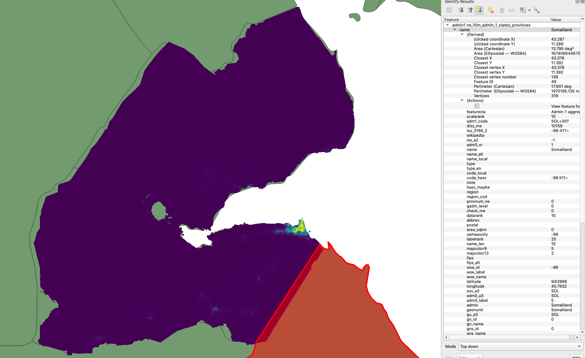

 # GeoTrellis WorldPop Jobs

This project generates summaries from WorldPop rasters for various regions.
WorldPop at 100x100m resolution is distribted in per-country raster format.
Together these rasters form a uniform layer and join seamlessly.

However, it is important to realise that summary regions may not line up with WorldPop country borders.
Consider WorldPop Djibouti raster vs surrounding Admin1 regions from NaturalEarth:



In order to avoid excluding population where the region does not cover the country this project tiles all of WorldPop rasters together. For the example above the Natural Earth Admin1 region for Djibouti will include counts from Eritrea and Etheopia raster for the slivers to the left.

## WorldPop for NaturalEarth Admin1 Regions
For testing

```
sbt:geotrellis-worldpop> test:runMain geotrellis.jobs.admin.Admin1PopulationApp -c DJI --output /tmp/dji-pop.csv --partitions 4
```

For EMR

```
sbt:geotrellis-worldpop> sparkCreateCluster
sbt:geotrellis-worldpop> sparkSubmitMain geotrellis.jobs.admin.Admin1PopulationApp --output s3://geotrellis-test/eac/ne-pop-2020-v1.csv --partitions 2000
# wait for completion ...
sbt:geotrellis-worldpop> sparkTerminateCluster
```

## WorldPop for IHME Regions

For testing

```
sbt:geotrellis-worldpop> test:runMain geotrellis.jobs.ihme.IhmePopulationApp -c DJI --output /tmp/dji-pop.csv --partitions 4
```

For EMR

```
sbt:geotrellis-worldpop> sparkCreateCluster
sbt:geotrellis-worldpop> sparkSubmitMain geotrellis.jobs.ihme.IhmePopulationApp --output s3://geotrellis-test/eac/ihme-pop-2020-v1.csv --partitions 2000
# wait for completion ...
sbt:geotrellis-worldpop> sparkTerminateCluster
```